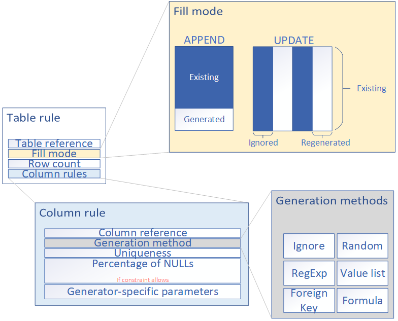
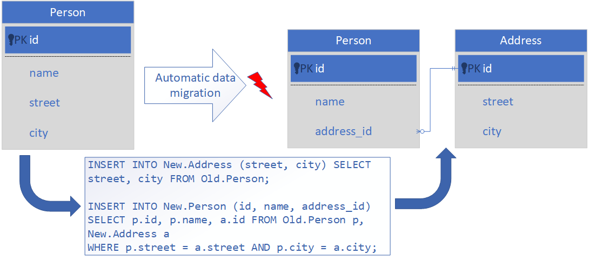

# TDMS

Test data management system helps developing and testing teams to generate realistically looking synthetic relational data, automatically deploy it to a staging database, and handle schema changes.

## Build and installation

1. Clone this repository.
0. Build TDMS by running **mvn package -P prod**. This will create an executable JAR (**core.jar**) with all dependencies as well as the Standard Extensions Plugin JAR (**std-extensions-plugin.jar**).
0. Clone [TDMS Demo Installation](https://github.com/imolcean/tdms_demo). This will be the installation of directory of TDMS.
0. Place **core.jar** into the installation folder.
0. Place **std-extensions-plugin.jar** into the **/plugins/bin** directory.
0. (Optional) Configure your installation using **application.properties** file.
0. Start TDMS by running **java -jar core.jar**.
0. In your browser, go to localhost:8080 (or whatever port you configured).

## Create a project

First of all, you need to create a project. To do so, open go to **Project > New**. You will need to provide the following parameters:
1. Project name.
2. Connection parameters of the internal DB.
3. Connection parameters of the temp DB (must be a different instance).
4. Data directory, that is a folder oin the file system where exported data will be stored and from where imported data will be taken.
5. (Optional) Schema update descriptor, that is the master changelog (in case of Liquibase) or its alternative.
6. (Optional) Pick extensions that will be used for data import, export, deployment, generation and schema update. Note that leaving some of these unspecified will limit functionality of the system.

You can change any of the above mentioned parameters later by going to **Project > Properties**.

When you are done creating your project, do not forget to save it (**Project > Save**). Download the project descriptor and place it somewhere on your computer. A good example of how to manage TDMS projects on your local machine can be found in [TDMS Demo Installation](https://github.com/imolcean/tdms_demo).

You can open previously created projects using **Project > Open**.

## Export / Import data

In order to export the test data, you first need to decide what format to use. TDMS supports JSON as serialisation format out of the box. If you like to use something else, you will probably need to write your own importer and exporter. Red about it in the last section of this Readme.

1. Go to **Project > Properties > Extensions** and pick correct extensions for import and export.
2. To export the data, go to **Data > Export**. If you use the standard JSON exporter, it will create a separate .json file for every table of your database with every row serialised as an object. The data will be stored in the data directory, that you configured in **Project > Properties**.
3. You can now do whatever you like with the serialised data. For example, store it in a versioned repository using Git.
4. To import the data, go to **Data > Import**. If you use the standard JSON importer, it will look for .json files in the data directory and try to parse them according to the currently used schema of the internal DB. Note that if the schema changed since the data had been exported, this will probably cause an error.

## Generate data

There are two ways to perform data generation. You can either use built-in rule-based generation engine or implement your own imperative generator. Implementing an own generator requires commitment but might be an option if you had a bunch of generation scripts previously, now want to introduce TDMS and don't want to reimplement everything using rules. If you use TDMS for a new development project, we recommend that you stick to rules.

Every table needs a rule to be filled with synthetic data. You can choose between two fill modes:

- APPEND will create new rows
- UPDATE will go through existing rows and generate new values for columns

Every table rule has column rules for every column. You can specify, whether generated data should be unique and what part of it should be NULL (this will not be an exact number, except you choos 0.0 or 1.0). The main part, however, is the generation method. There are several of those:

- Ignore - indicating that data should not be generated for the column
- Random - creates a random value of suitable data type (this is a family of methods, there is one for every type)
- Regexp - creates a random string that matches given regular expression
- Value List - picks a random value from the given list of options (list can be predefined or manually specified)
- Foreign Key - picks a random private key from the referenced table
- Formula - creates a value using provided script

### Formula Generation Method

Formula generation method is the most powerful feature of TDMS's data generation engine. It aims to cover complex cases when the other, easier to use generation methods, are not enough to express all the constraints of the synthetic data. You use a scripting programming language to describe the generation process.

#### Call previously stored JS code

TDMS allows to reuse some scripting code by storing snippets in the file system. The stored scripts can then be called as functions. In the following example, the function **CountryToCode3** is provided by the user, it takes a string containing a name of a country and returns its three-letter code.

*CuntryToCode3(‘Germany’).toUpperCase();* will return the string *DEU*.

#### Call other generation methods

Scripts used in formula generation method can call other generation methods as part of their logic. For example, formula generation method running the following script will reuse the regular expression generation method to create a phone number.

*RegExp(‘^[+]*[(]{0,1}[0-9]{1,4}[)]{0,1}[-\s\./0-9]*$’);*

#### Use Value Libraries

Value Libraries are JSON objects which constitute knowledge base that is used by the generation logic. For example, the following Value Library stores information about German cities stored by the region.

*$LibCountries: {
"all": [
{
"name": "Germany",
"regions": [
{
"name": "Niedersachsen",
"cities": [
"Hannover",
"Osnabrück",
"Melle",
...
]
},
...
]
}
]
}*

You can use the following generation script to fill a column with random cities from the region of Lower Saxony.

*RandFrom(*  
*$LibCountries*
*.all*  
*.filter(c => c.name == 'Germany')*  
*.regions*  
*.filter(r => r === 'Niedersachsen')*  
*.flatMap(r => r.cities));*

#### Intra-row dependencies

It is possible to generate data with intra-row dependencies. Due to lack of built-in RDBMS mechanisms for their definition, scripts for the formula generation method are used to describe them. When user writes a script to generate values for a column, he can refer to other columns of the same table by their name prefixed by a special character. The following example describes generation of a postal code for an address in Germany. The address is stored in four different columns in the same table.

*GermanZip($state, $city, $street, $house);*

## Handle schema changes

There are two strategies to handle schema changes: iterative and diff-based. Both are based on changelogs, like in Liquibase or Flyway.

### Iterative schema update

This approach requires that for every change of the schema, a changelog is provided that contains, among other things, changes to the data. That is, if you changed a primary key column of a table, changelog needs to contain an SQL script that changes foreign keys of all referencing tables. Using this approach is a good practice anyway and it allows to change the schema pain-free even if the database isn't empty.

1. Go to **Project > Properties > Extensions** and ensure that **i.g.i.t.c.LiquibaseIterativeSchemaUpdater** is selected as active schema updater.
2. Go to **Project > Properties > General** and ensure that your main changelog (the one that imports all the others) is correctly pointed to by the **schema update descriptor** field.
3. Go to **Schema > Schema update** and go through the steps.

### Diff-based schema update

This approach doesn't require to keep track of your schema changes over time. The only thing that is needed is the changelog that describes changes from completely empty DB to the desired state. TDMS will determine the changes that it needs to make in order to bring schema to this state. There is a drawback, however. The user will need to provide so-called migration scripts for the tables, that is SQL scripts describing how to bring the data from the previous state of the table to the new one.

1. Go to **Project > Properties > Extensions** and ensure that **i.g.i.t.c.LiquibaseDiffSchemaUpdater** is selected as active schema updater.
2. Go to **Project > Properties > General** and ensure that your changelog is correctly pointed to by the **schema update descriptor** field.
3. Go to **Schema > Schema update** and go through the steps. After the changes are successfully applied to the temp DB, you will be requested to provide migration scripts for every table that has changed or been newly added. You can do this using standard SQL with two additional keywords. Use **OLD** to refer to the previous state of the table, use **NEW** to refer to the new one. Tables that require a migration script but don't get one will stay empty. Note that this might affect referential integrity.

## Deploy data

You can deploy the test data into a staging environment by copying it from the internal database.

1. Go to **Project > Properties > Extensions** and ensure that **i.g.i.t.x.deployers.MigrationDeployer** is selected as active deployer.
2. Open the dialog **Connections > Stages**.
3. Add a new staging environment or select an existing one.
4. Ensure that the staging DB has the same schema as the internal DB. If this is not the case, you can use the button **Apply schema**.
5. Start deployment using the button **Deploy data**.

## Extension development

You can create your own extensions using TDMS API, which is located in module **api** of this project. TDMS provides so-called public interfaces that are simple Java interfaces. They are the following:

1. DataImporter
2. DataExporter
3. Deployer
4. DataGenerator
5. SchemaUpdater

An extension should implement one of these interfaces as well as carry annotations

1. org.springframework.stereotype.Component
2. org.pf4j.Extension

More information about general approach to writing extensions and plugins using PF4J library can be found [here](https://pf4j.org/). You can also use TDMS Standard Extensions Plugin as a reference implementation, it can be found in module **std-extensions-plugin** of this repository. Especially note, how POM is used to build a plugin JAR.

When a plugin containing your extensions is built, place it in the **/plugins/bin** directory of the TDMS installation. After restarting the application, your extensions should become visible in the extensions selection dialog (**Project > Properties > Extensions**).
